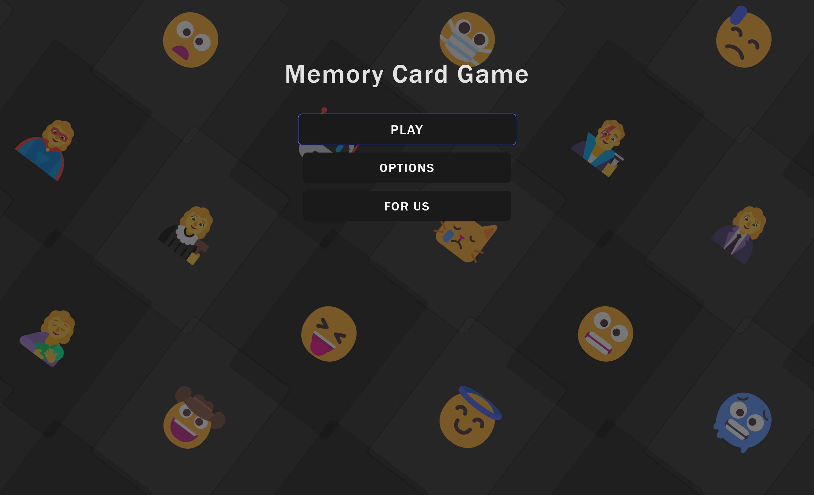
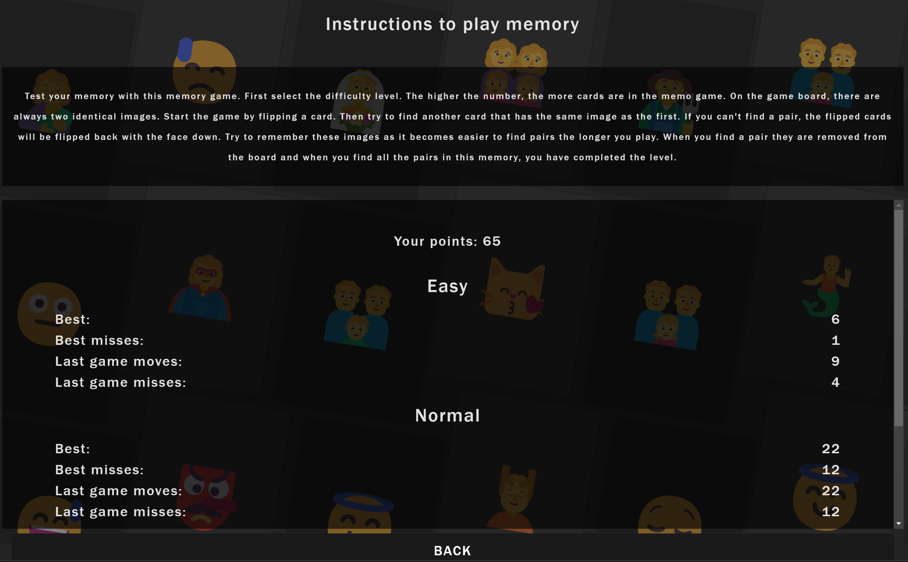
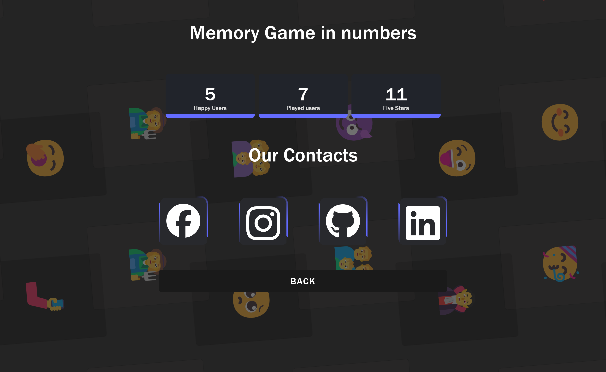
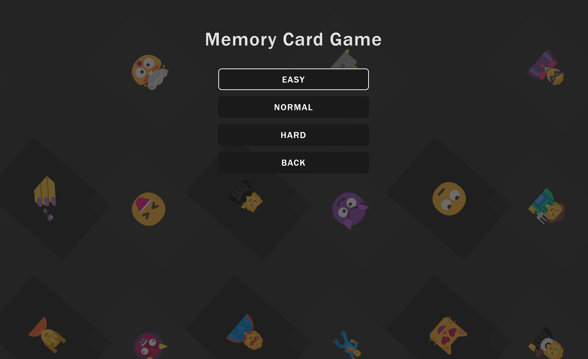
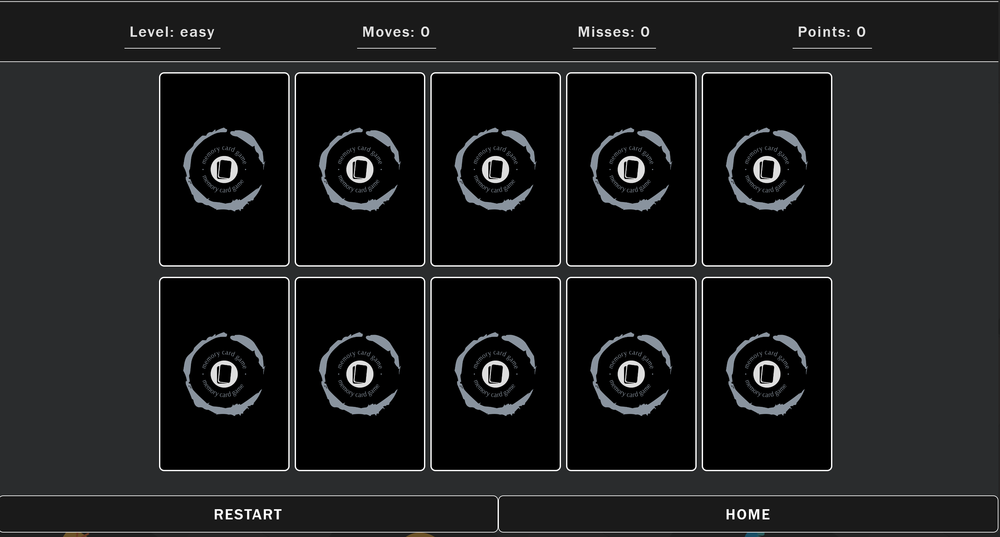
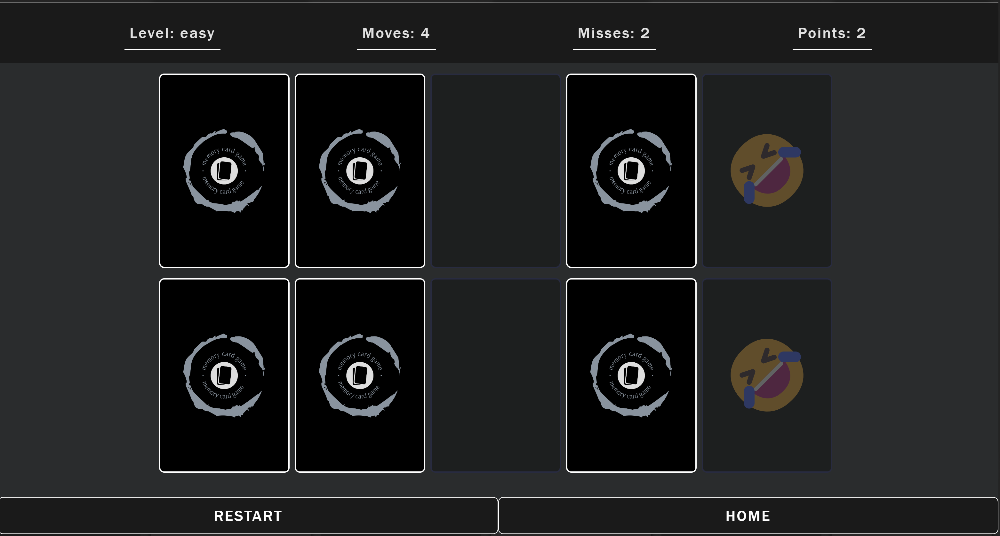
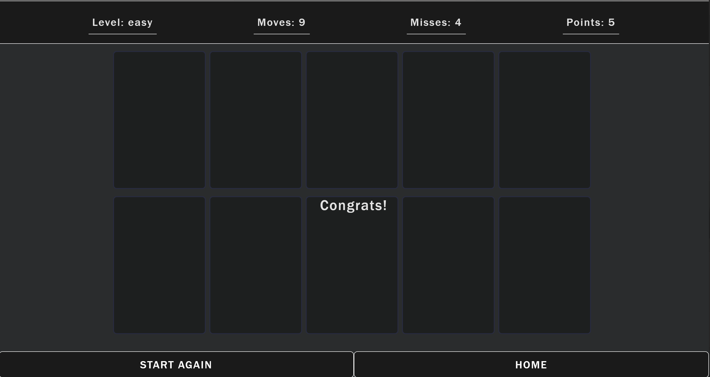

# Memory Card Game with React

- [x] **Main Menu**

Welcome screen where users can start the game, choosing between different difficulty levels: easy (10 cards), normal (20 cards), and hard (30 cards). Users also have access to the options menu, which includes game rules and user score statistics. Additionally, the "For Us" section contains links to the developers' profiles on GitHub, Instagram, and LinkedIn.

- [x] **Options**

Users can review the rules of the game and track their personal score statistics in this section.

- [x] **For Us**

Offers users links to connect with the developers through various platforms such as GitHub, Instagram, and LinkedIn.

- [x] **Levels**

Users are presented with a welcome page that offers different difficulty levels: easy, normal, and hard, each with corresponding card counts (10, 20, and 30 cards respectively). Below, users can find game rules and an option to leave.

- [x] **Game (easy mode)**

 Users enter the easy mode game interface, where they are presented with 10 cards to match. The welcome page includes game rules and an option to leave.

- [x] **Matched card**

Users view matched cards during gameplay. The welcome page includes game rules and an option to leave.

- [x] **End Game**

Users reach the end of the game screen, where they can restart or exit. The welcome page includes game rules and an option to leave..

